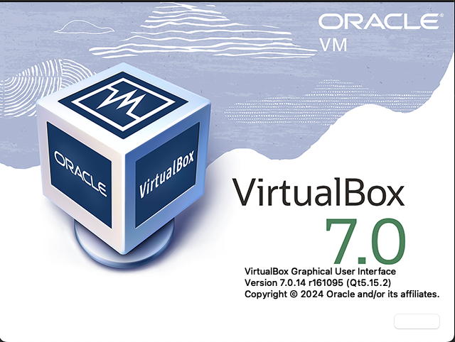

# TrustCare Health Systems - Project Setup

---
### 🛠️ Overview 

This project can be setup using any virtual machine of your choice. I have a latest Mac Studio with Apple silicon m2 chip but due to this not 
being able to run the latest VirtualBox, I had to fall back to using my older silicon mac mini. 

On my mac mini due to resource constraints I only created the minimum virtual machines needed to simulate the late and achieve the AD requirements 
for TrustCare. For example: A minimum of 14 domain controllers was needed for all regions across US, with 3 DC for the HQ in Atlanta for load balancing and redundancy. I created 3 DCs for Atlanta, howevery just one for the rest of the regions. In a real-world environment where resources are available this would not be the case. Perhaps at least 2 DCs for each regions to accomodate resource needs.

Here are the details of VirtualBox I Used and my Mac Mini configurations- 
### VirtualBox
**Version:** 7.0
**Build:** 7.0.14 r161096 (Qt5.15.2)
**Year:** 2024  

### Mac Mini
**Processor:** 3.2 GHZ 6 Core Intel Core i7
**Graphics:** Intel UHD Graphics 630 1536 MB
**Memory** 64 GB 2667 MHz DDR4  
**MacOS:** Sequoia 15.5

---

### 🔧 Steps

1. Download VirtualBox
2. Install 

---
### 🏢 Company Background and Overview 
Please see [company-background](./docs/company-background/Step-A.pdf)

