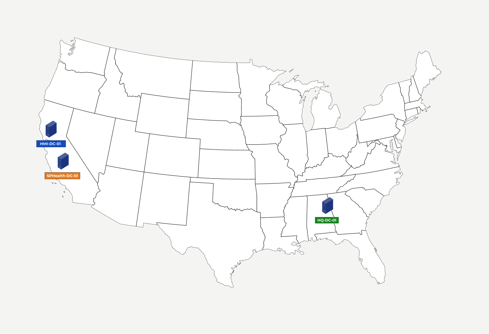

# Setting up the first Domain Controller

---
### ⭐️ Objective 
1. Create the first domain to represent trustcare.corp 
2. Install Windows Server and AD
3. Promote server to Domain Controller 
4. Show Migration Plan Documentation 

---
### ✅ Key Deliverables:
- [x] Domain architecture diagrams
- [x] Forest trust configuration
- [x] DNS structure implementation
- [x] Migration planning documentation

---
### 🧠 Key Takeaways 
1. I setup the first Domain Controller inside the trustcare.corp by creating a new forest 
2. The forest relies on DNS to locate resources on the network. The naming system also helps Active Directory
3. I can add to existing DC in forest when I setup additional regional DC's Eg Nashville, Chicago, Denver etc
4. Two temporary child DC will be setup under trustcare.corp for phased migration 
5. This will be done using the option "add a new domain to an existing forest"
6. Under the tustcare.corp, from step 5, I can have 2 child domain for the aquisition - hmi.trustcare.corp and sphealth.trustcare.corp
7. Global Catalog is light DC like phonebook to look up resources based on special attributes 
8. The term "Active Directory" also referes to the other services & tool like ADFS, ADCS and ADRMS

---
### 🛠️ Overview 

For Domain - trustcare.corp, I need to setup the first Domain Controller in Atlanta HQ then install Windows Server 2022. After doing this I installed Active Directory and then promoted the server as Domain Controller. For regional stability, I will create additional domain controllers for Atlanta but this will be done in the next step.

For more about the c ompany Background and Overview please see [company-background](./docs/company-background/Step-A.pdf) and for the figma slides -
[](https://www.figma.com/design/S2MGklpLjUfkLbXQ4UtUwJ/TrustCare-Health-Systems-Slides?node-id=1103-1218&t=2Tsikco2pbxR6ma3-1)


---
### 📁 Creating Atlanta HQ DC 
Here are the steps Atlanta DC - HQ-DC-01

Creating the VM
1. Click on “new” to create a VM and then enter the name: HQ-DC-01
2. Select the Win Server iso and add the ram and disk size
3. Enter credentials for username: admin-cemeh
4. Enter password: Enterprise1.
5. Change domain name to: trustcare.corp and select the server desktop version 
6. Setup the hardware: 4GB for Ram and 2 CPU, disk 50GB
7. Allow server to load up until green
8. Update the resolution of VM if needed

Installing Active Directory 
1. Open Server Manager > Add Roles and Features 
2. Select Role-based or feature-based installation 
3. Select HQ-DC-01 and then “Active Directory Domain Service”
4. Make sure Group Policy is selected 
5. Continue Installation until finished 
6. Once done sign out 

Sign in with Adminstator Account & Promote Active Directory 
The user account admin-cemeh is does not have admin privileges yet we need to use the sudo (or Administrator) version of this server which is "TrustCare/Administrator"
1. To unlock select Input > keyboard > Insert-ctrl-alt del
2. The password will be the same as admin-cemeh (Enterprise1.)
3. Now we can elevate admin-cemeh using administrator account 
4. Next select manage and promote to Domain Controller 
5. We will see 3 options (I, will explain later) for now select Add a new forest, then enter “trustcare.corp”
6. Make sure to select Forest functional level and check DNS and Global Catalog I will explain these 
7. Add a recovery Password - Recovery1. (Click Next)
8. Skip creating DNS delegation
9. Continue after NetBIOS appears
10. Continue until click install and then restart once done
11. To Sign in as admin use Administrator and then use same password

---
### 🏢 Domain Architecture Diagram
```
# Active Directory Domain Structure Evolution
# Colors:
#   - GREEN: TrustCare
#   - BLUE: HMI
#   - ORANGE: SPHealth
#   - GRAY:  General Notes/Connectors
#---------------------------------------------------------------------------------------
# Phase 1: Before Transition / Initial State
#---------------------------------------------------------------------------------------
# Primary Domain
GREEN trustcare.corp
#
# Child Domains (Acquired Companies)
#
BLUE    hmi.com
ORANGE  sphealth.com
# Schematic Representation:
#                                  trustcare.corp  (GREEN)
#                                      /       \
#                                     /         \
#                                hmi.com (BLUE)   sphealth.com (ORANGE)
#---------------------------------------------------------------------------------------
# Phase 2: During Transition / Merger in Progress
#---------------------------------------------------------------------------------------
# Structure remains the same during the transition period.
# The goal is to migrate resources and users from HMI and SPHealth
# into the TrustCare domain.
# Schematic Representation (Same as Phase 1):
#                                  trustcare.corp  (GREEN)
#                                      /       \
#                                     /         \
#                                hmi.com (BLUE)   sphealth.com (ORANGE)
#---------------------------------------------------------------------------------------
# Phase 3: After Transition / Desired State
#---------------------------------------------------------------------------------------
# All resources and users are now under the TrustCare domain.
# HMI and SPHealth domains are decommissioned or no longer in active use.
# Primary Domain
GREEN trustcare.corp
# Schematic Representation:
#                                  trustcare.corp  (GREEN)
#                                         |
#                                         |
#                  (All resources and users consolidated here)
#---------------------------------------------------------------------------------------
# Additional Notes:
# - This is a simplified representation.
# - OU (Organizational Unit) structure within trustcare.corp will be designed
#   to further organize users, computers, and resources (e.g., by location, department). [cite: 10]
# - Trust relationships might be used during the transition to allow access
#   between domains, but the final state is a single domain.
#---------------------------------------------------------------------------------------
```
Screenshots of Forests 



---
### 🛠️ Forest Trust & DNS implementation in Active Directory 
Here I begin by configuring the first domain contoller at the Atlanta HQ-DC-01: TrustCare Forest - Windows Server 2022, Active Directory and DC setup. This is covered in the steps for creating the Atlanta DC above, however I will only add a few summarized screenshots.

Step 1 - Setting up Atlanta VirtualBox


Step 2 - Install Active Directory 


Step 3 - Promote Atlanta to Domain Controller 


Step 4 - Setup DNS


Step 5 - Compete Atlanta HQ setup - HQ-DC-01


---
### 🚧 Migraton Plan Documentation 
Phase 1 - Before Transition 
During the first phase after aquisition there are 3 separate forests. All the employee account and resources are separated.


Phase 2 - Establish Forest Trust
During phase 2, I can establish a two-way forest trust so that employees in HMI and SPHealth can access resources in TrustCare. Athough this is beyond the scope of the project just showing my thinking process.
1. Employees will have 2 accounts eg jane@hmi.com or trustcare\jane@hmi.local
2. I will then configure DNS so that the internal name is resolved to the external
3. Employees can access resources in TrustCare 


Phase 3 - Migration to Child Domains
Next I will create 2 new local domains under TrustCare forest to represent HMI and SPHealth. The structure remains the same during this transition period. The goal is to migrate resources and users from HMI and SPHealth into the TrustCare domain. The child domains are temporary and will later be decommission. The following scenario will take place: 
1. Employees can use new temporary account of the child domains Eg jane@hmi.trustcare.corp
2. This can be done in the weekend to prevent disruption 
3. Employees have access to legacy and new resources


Phase 4 - Decomission original Forests 
After all the employees and resources are migrated then the original forests are decommissioned. Additionally, users are migrated from the child domain to the parent. The following scenario will take place:
1. Employee now has jane@trustcare.corp in addition to jane@hmi.trustcare.corp
2. Plans to decommission the child domain will be announced this can happen over the weekend to prevent disruption
3. On Monday employees can sign in with jane@trustcare.corp after child is decomissioned 


Phase 5 - Consolidated Phase 
All employees and resources are now consolidated into the TrustCare domain

