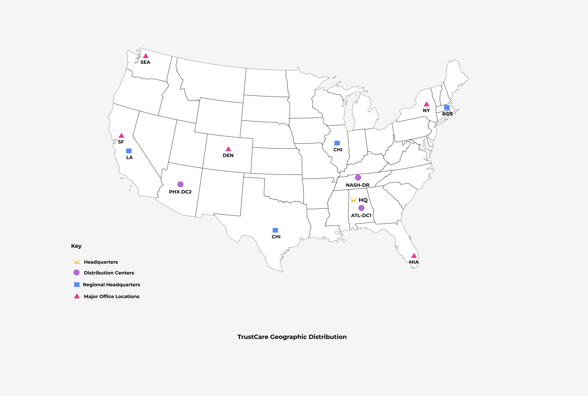
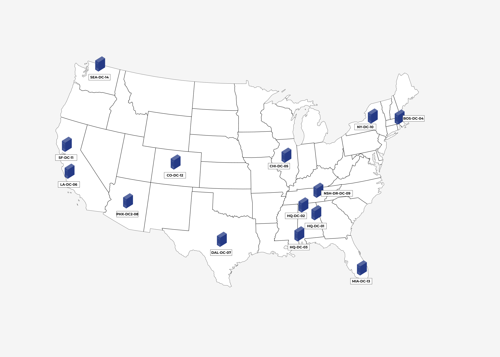
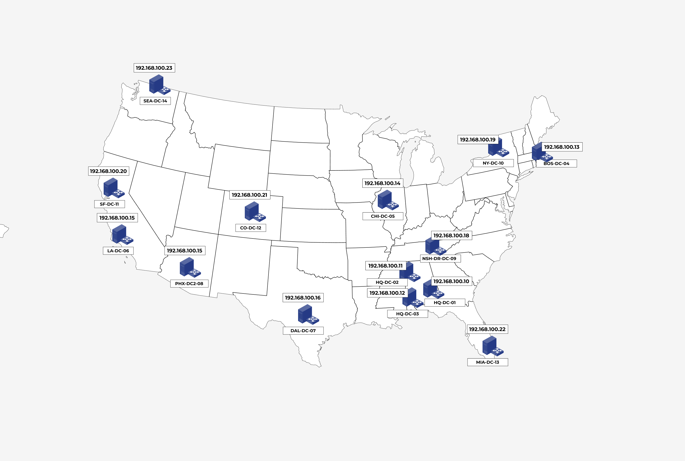
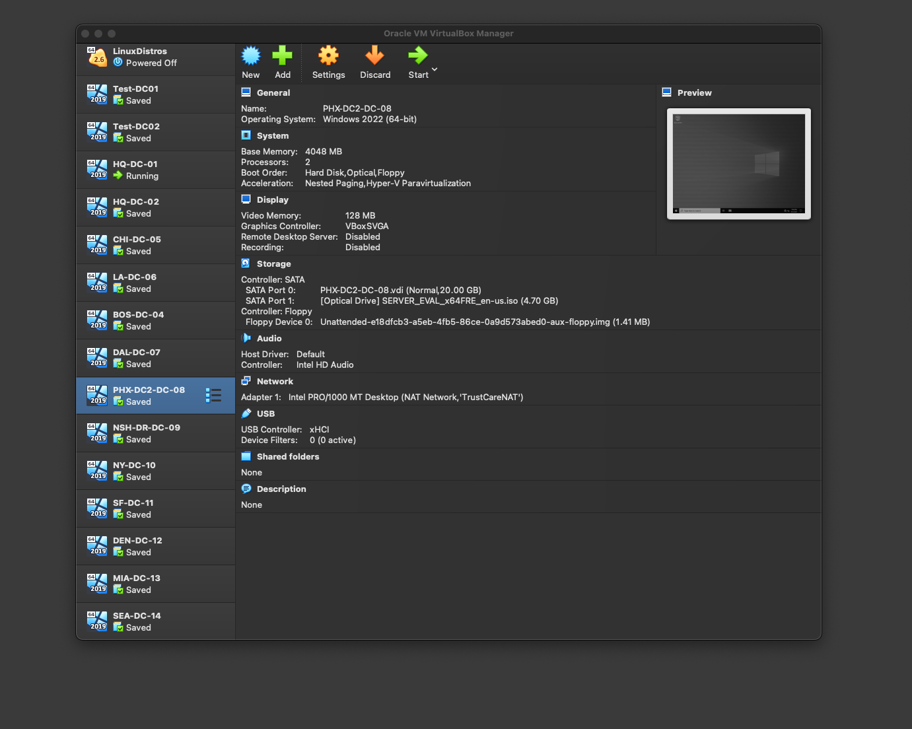
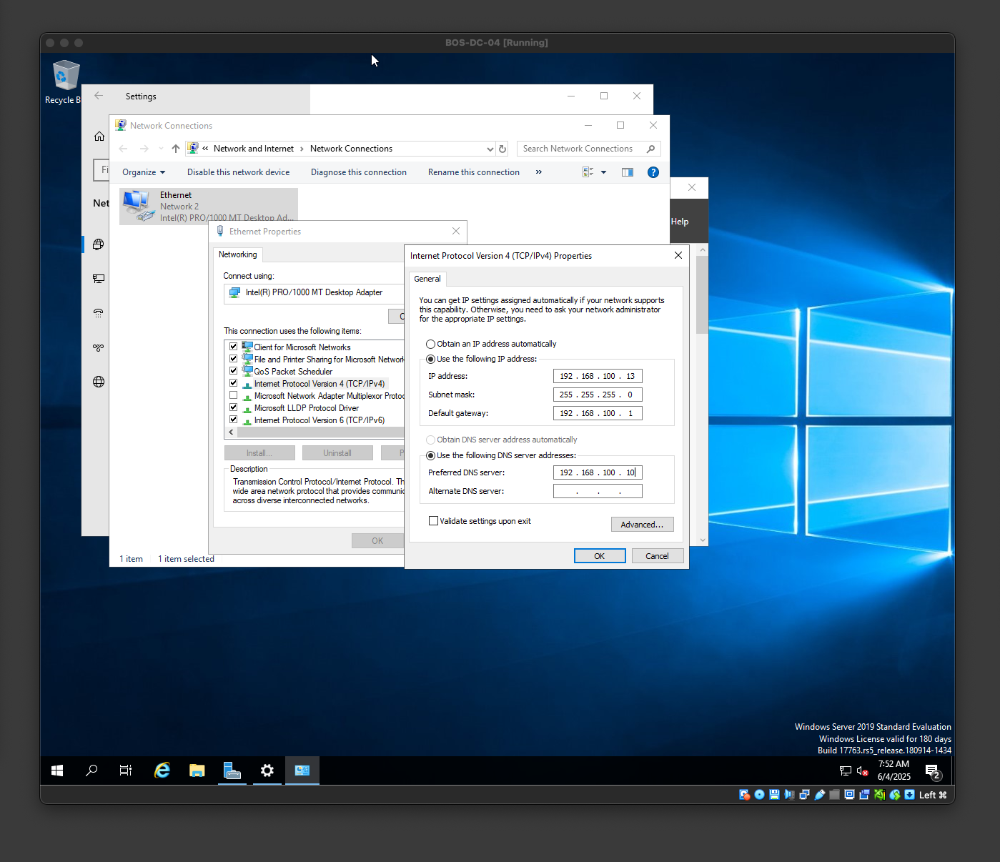
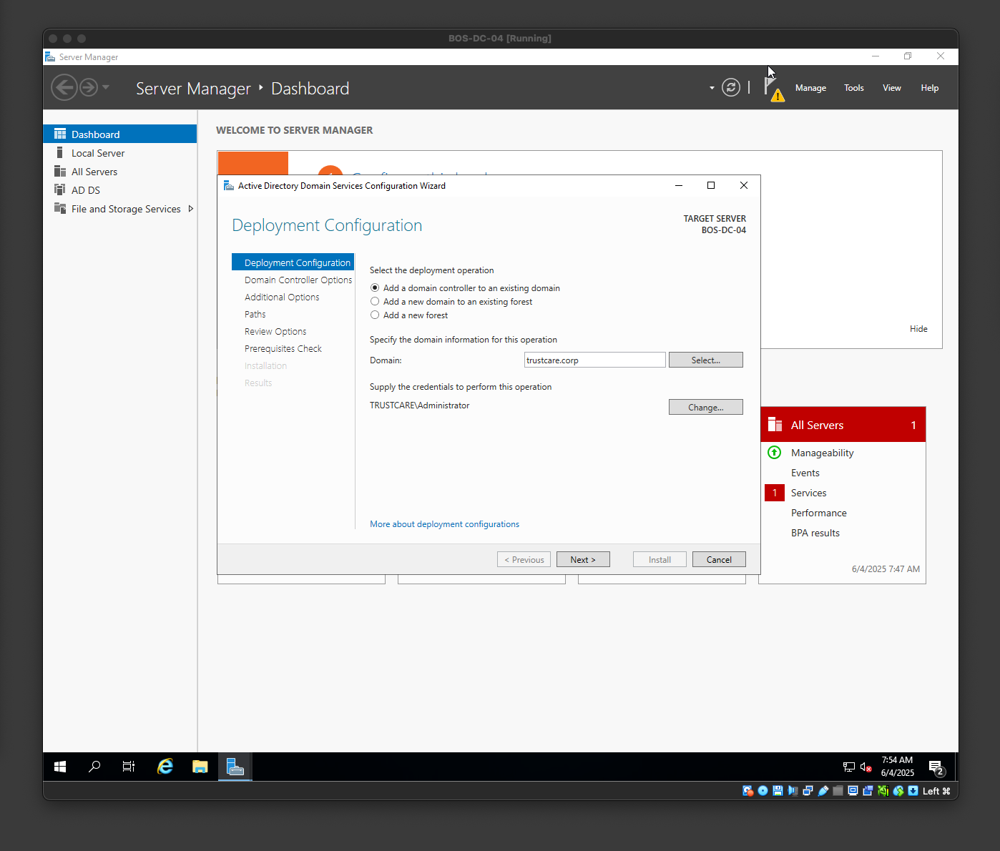
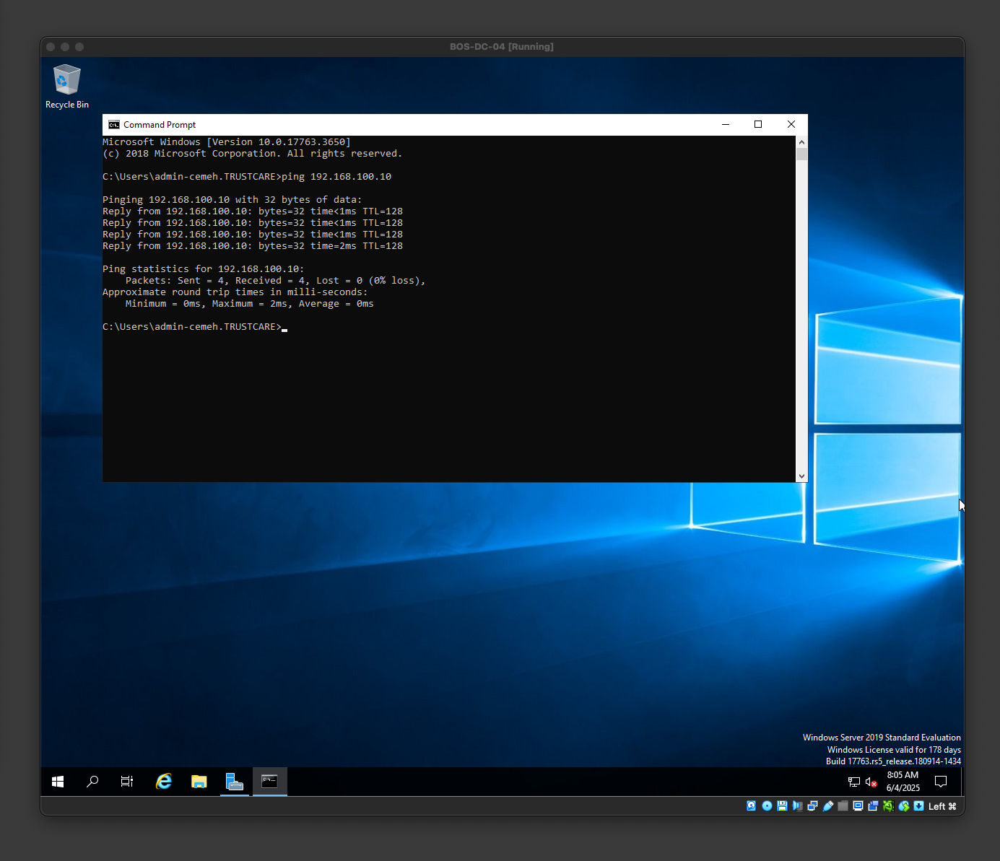
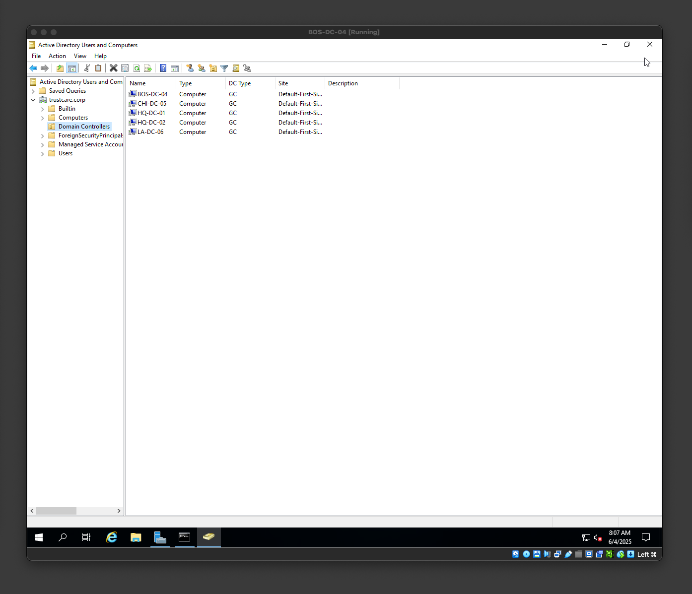
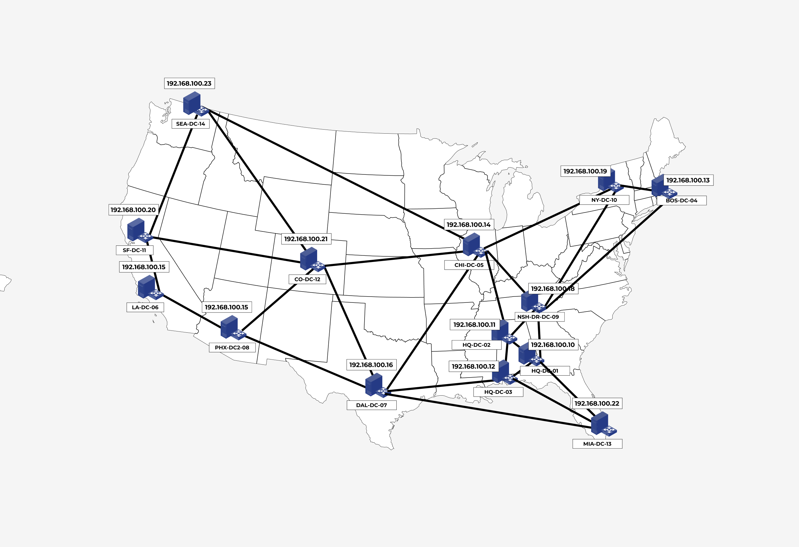
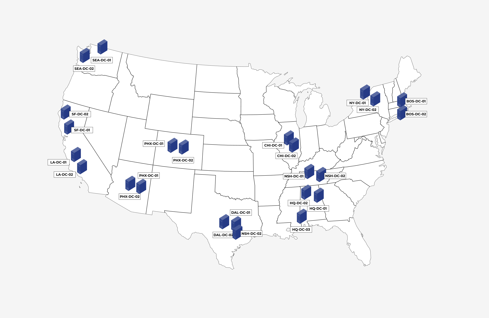

# Physical Infrastructure

---
### ⭐️ Objective 
1. Minimum of 12 domain controllers across locations
2. Site-based replication topology
3. High availability for critical authentication services

---
### ✅ Key Deliverables:
Design and deployment of domain controllers across TrustCare's geographic locations with proper site topology and replication strategies.
- [x] 14 domain controllers across 12 locations
- [x] Site and services configuration
- [x] Replication topology optimization
- [x] High availability implementation

---
### 🧠 Key Takeaways 
1. Active Directory is distributed 
2. It works like Git but used RDP and dates back pre HTTP - will write an article on this
3. There is a lot of thought on redundancy & high availablity
4. No one Domain Controller own's the Active Directory - It is distributed
5. AD relies heavily on DNS - basically IP addressed are resolved to the DC
6. You can configure IP for each DC virtual machine in virtual box
7. Replication is cruicail to ensire consistency of the AD - There is a lot that goes into this
8. The site links are also a consideration on how the AD asks for information during replication 
9. Oh and the database for AD is also distributed 
10. Domain controller is just a machine running AD

---
### 🌎 Geographic Distribution



---
### 🏢 Domain Architecture Diagram
Below is the distribution of 14 domain controllers across 12 locations 
```
# Active Directory Physical Infrastructure Design

# Colors:
#   - GREEN: TrustCare Locations
#   - GRAY:  General Notes/Connectors
#   - YELLOW: Domain Controllers

#---------------------------------------------------------------------------------------
# Requirements:
#   - Minimum of 12 domain controllers across locations
#   - Site-based replication topology
#   - High availability for critical authentication services
#---------------------------------------------------------------------------------------

# Locations (from document):
# - Headquarters: Atlanta, GA (HQ) [cite: 21]
# - Regional Headquarters:
#     - Northeast: Boston, MA (BOS) [cite: 21]
#     - Midwest: Chicago, IL (CHI) [cite: 21]
#     - West Coast: Los Angeles, CA (LA) [cite: 21]
#     - Southwest: Dallas, TX (DAL) [cite: 21]
# - Distribution Centers:
#     - Primary: Atlanta, GA (ATL-DC1) [cite: 21]
#     - Secondary: Phoenix, AZ (PHX-DC2) [cite: 21]
#     - Tertiary/Backup: Nashville, TN (NSH-DR) [cite: 21]
# - Major Office Locations:
#     - New York, NY (NY) [cite: 21]
#     - San Francisco, CA (SF) [cite: 21]
#     - Denver, CO (DEN) [cite: 21]
#     - Miami, FL (MIA) [cite: 21]
#     - Seattle, WA (SEA) [cite: 21]
#---------------------------------------------------------------------------------------

# Domain Controller Distribution Strategy:
# - HQ/Regional HQ:  2+ DCs for high availability and local authentication
# - Distribution Centers: 1-2 DCs (depending on size/criticality)
# - Major Offices: 1-2 DCs (depending on office size)

#---------------------------------------------------------------------------------------
# Schematic Representation:
#---------------------------------------------------------------------------------------

# Atlanta (HQ + Primary DC)
GREEN Atlanta, GA (HQ/ATL-DC1)
#   |---YELLOW DC01 (Primary) - 192.168.100.10
#   |---YELLOW DC02 (Primary) - 192.168.100.11
#   |---YELLOW DC03 (DR/Backup) - 192.168.100.12

# Regional Headquarters
GREEN Boston, MA (BOS)
#   |---YELLOW DC04 - 192.168.100.13
GREEN Chicago, IL (CHI)
#   |---YELLOW DC05 - 192.168.100.14
GREEN Los Angeles, CA (LA)
#   |---YELLOW DC06 - 192.168.100.15
GREEN Dallas, TX (DAL)
#   |---YELLOW DC07 - 192.168.100.16

# Distribution Centers
GREEN Phoenix, AZ (PHX-DC2)
#   |---YELLOW DC08 - 192.168.100.17
GREEN Nashville, TN (NSH-DR)
#   |---YELLOW DC09 - 192.168.100.18

# Major Office Locations
GREEN New York, NY (NY)
#   |---YELLOW DC10 - 192.168.100.19
GREEN San Francisco, CA (SF)
#   |---YELLOW DC11 - 192.168.100.20
GREEN Denver, CO (DEN)
#   |---YELLOW DC12 - 192.168.100.21
GREEN Miami, FL (MIA)
#   |---YELLOW DC13 - 192.168.100.22
GREEN Seattle, WA (SEA)
#   |---YELLOW DC14 - 192.168.100.23

#---------------------------------------------------------------------------------------
# Site Topology Configuration (Illustrative - requires AD Sites & Services config)
#---------------------------------------------------------------------------------------
# - Sites created for each GREEN location (e.g., "Atlanta-HQ", "Boston-RHQ")
# - Replication links configured to optimize traffic flow (e.g., Hub-and-Spoke, Ring)
# - Atlanta (HQ) acts as a potential hub site.
# - Site links configured with appropriate costs and schedules to control replication.

#---------------------------------------------------------------------------------------
# High Availability Considerations:
# - Minimum of two DCs at major locations to prevent single point of failure.
# - Redundant network connections.
# - UPS and generator backups for critical sites.
# - Read-Only Domain Controllers (RODCs) at smaller/less secure sites (if applicable - not explicitly shown here for simplicity).
#---------------------------------------------------------------------------------------

# Total Domain Controllers: 14 (Meets the minimum requirement of 12)
```
TrustCare Region showing 14 Domain Controllers 


Assigning IP to 14 sites


---
### 🏢 Site & Service Configuration 
 For the 14 regions, I created 14 unique IP address in VirtualBox. Then created 14 VM to represent these area. All location are promoted to DC and linked to the first DC. By doing this I actually discovered that there is no "one" DC per location. The Active Directory is distributed among the locations. For instance if an employee jane@truscare.corp who works in Colorado goes to Atlanta for regional meeting, she can still login at the HQ and use the credentials there, or any other location. It bewildered me because it works a little like git but I discovered it's actually RDP and was built before HTTP. So I will have to write an article on this. 

Virtual Box Setup


Boston IP setup 


Boston DC-04 Setup


Boston Ping Atlanta HQ


All Locations DC Setup 


---
### 🏢 Replication Topology Optimization 
Below is the replication topology of the 14 domain controllers across 12 locations




---
### 🏢 High availability Implementation  
Currently there are 14 domain controllers across 12 locations. The Atlanta HQ has 3 domain controllers for high redundancy. Although the other locations have just one domain controllers, to increase high availability, we can increase the number of DCs per location. I'm going to show how this would look but due to resource contraint, I will not implement this in VirtualBox but just sticking with the 14 DCs for now. Having more than one DCs per location will provide high availability in the following ways: 
1. High reducndancy for point of failure: If one machine goes down, this could disrupt authentication or other services when employees query due to the location of the LDAP Kerberos servers. By having at least 2, if one goes down the other one can be used to serve requests
2. During maintenance this will be useful to keep services running. There can be scheduled maintennance at night or at weekends during off business hours. The system will need to be back during working hours. Having more than 2 alleviates this.
3. Distrbuted endpoints: If there is an attack on one DC and the activity is detected, this can help isolate the DC affected while the other one is up running and serving the users

