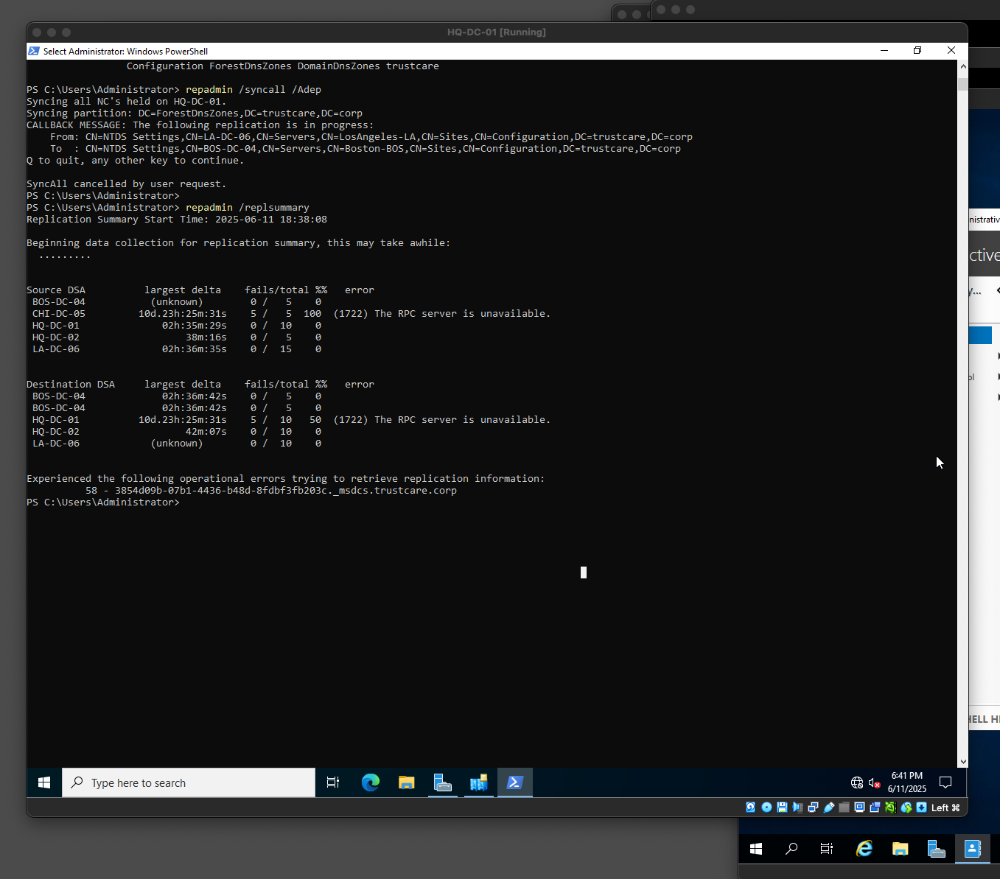

# Migrate Local DC to new Site

---
### 🏢 Scenario 
TrustCare IT Request: We have just setup all DCs in our Atlanta HQ for upcoming regions. We need to move LA-DC-06 from temporary 
Atlanta hosting to the new Los Angeles data center

---
### 🏗️ Site Migration Process
1. Moved DC to correct site (Los Angeles-LA)
2. Verified replication is functioning
3. Confirmed directory synchronization
4. Validated services are operational

Result: Los Angeles pharmacy staff can authenticate locally instead of reaching back to Atlanta!

---
### 🏆 Impact 
1. Faster authentication for LA pharmacy staff
2. Reduced WAN traffic (authentication stays local)
3. Better disaster recovery (LA can operate independently)
4. Improved compliance (data locality for auditing)

---
### 📁 Background 
When I started adding new sites to Active Directory, I thought it was simply just adding a new DC to the current existing domain. So for the trustcare.corp first I added 2 additional DC for Atlanta HQ, then I created DCs for the other regions totaling 14. But I made a mistake here thinking by just adding these DCs and changing the name this will serves as Sites. Well, it turns out this was just adding multiple DCs for just one site - the Atlanta HQ site only. While this will help in redundancy and availability, it doesn't represent the true physical locations. Im glad I encountered this error and by correcting myself I've learned a lot. Enter Site Migration 
[Picture showing AD sites under Atlanta HQ]

---
### 🚆 Site Migration 
A site is a representation of the physical location of the domain controller. So for trustcare we have HQ in Atlanta and other locations (14). We have to use the Active Directory Site & Services, with administrator account or the right privilege to do this. Having all the DC in one site was a mistake at first but later I discovered creating and then moving DCs to site is a site migration strategy. Suppose in Atlanta the execs plan to open a new location in LA and they want some staffs to go there once the site is opened. We can setup a temporary (LA) site in Atlanta with the users, resources, as well as policies needed and then they can begin working and doing daily activities. Once the site building in LA is completed and commissioned this temporary one in Atlanta can be migrated to the actual LA site. There are great benefits because there will be zero downtown and smooth transition during maintenance window, flexibility in infrastructure, and opportunity for compliance and regulation continuity. So it was a blessing in disguise. Below is a detail plan of site migration strategy 

---
### 🚧 Stategic Site migration 
Current DCs in Atlanta HQ

New Site created and move local LA-DC-06 with Link DEFAULTIPSITELINK

All other local DCs moved to Sites

Sites configuration in AD Site & Services 

Successful replication of Atlanta-HQ-01 in CHI-DC-05

---
### 🛑 Learning by Errors
When I discovered the mistake I felt the need to delete all the VMs and start afresh. But I also had a thought of figuring out how to fix it as a learning approach. This led me to exploring Active Directory Sites & Services to create the actual sites representing the physical locations. This would also require me to move the sites from Atlanta to respective locations. I also learned we must configure subnets and do several replication attempts, as in, the real maintenance - had to wait for 3 hours to see replication. I think this approach of learning is much rewarding because I am breaking things and instead of starting from scratch or following tutorial to avoid error, I welcome it as an approach to learn more. 
The great thing about this learning by recorrecting error experience is that I can now see my mistake with a new lens and perspective.

Site Links Optimization Opportunities
We can improve the site links that connects the sites together eg from Atlanta to Chicago. Currently we have a default link called DEFAULTIPSITLINK. So we can have several links based on compliance and cost reduction opportunity 

Default Site Link

---
### 🔨 Skills I acquired by doing this: 
**☑️ Enterprise-Level Skills Demonstrated**
1. Site topology management
2. Cross-site replication validation
3. Directory service verification
4. Professional testing methodology
5. Disaster Recovery and Geographic expansion 

**☑️ Technical Skills Learned** 
1. Multi-site AD architecture
2. DC placement strategies
3. Replication troubleshooting
4. Enterprise change validation
5. Healthcare infrastructure management

**☑️ Resume Skills**
1. I managed enterprise Active Directory with 14+ domain controllers across multiple geographic sites
2. I successfully performed site migrations with zero service disruption
3. I was able to validate multi-site replication in healthcare compliance environment

**Errors Encountered and solved** 
Please see powershell scripts for code

**Error 1722** 
Message: The RPC Server is unavailable
Root Cause: - Not setting the subnet for new site 
Fix: Must add subnet for all new sites and assign to respective DC 

**NSLookup Issue** 
Message: Target Principal Name Incorrect 
Root Cause: - Replication not taking effect 
Fix: Do a site replication and then update "Leap Indicator" on local machine

