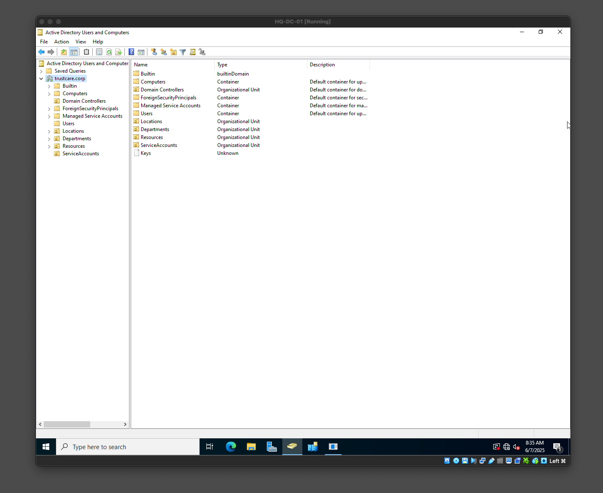
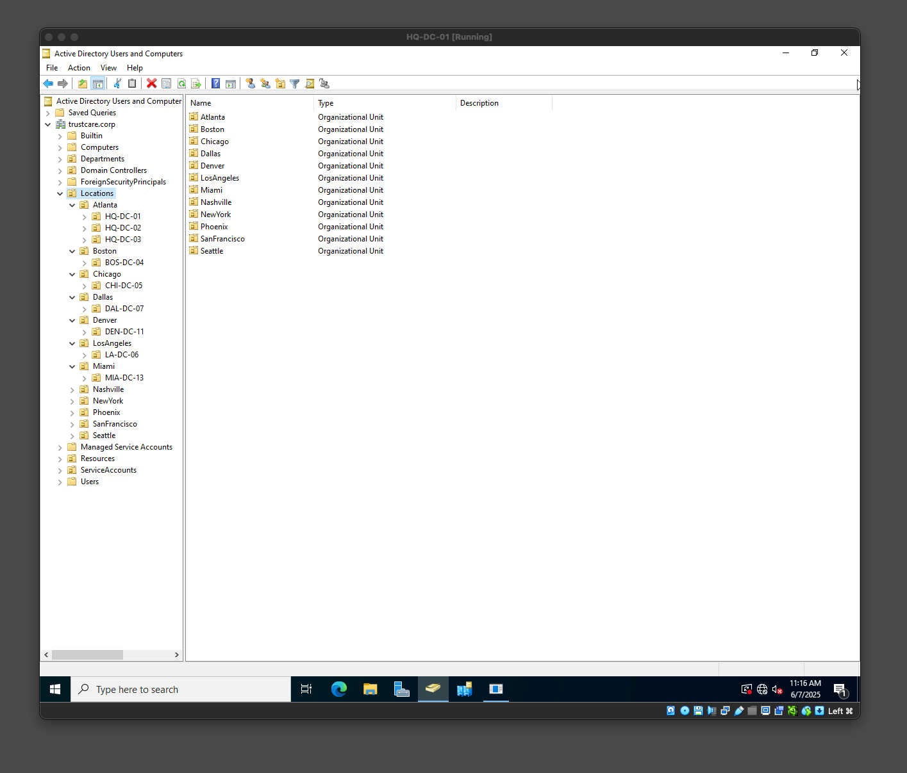
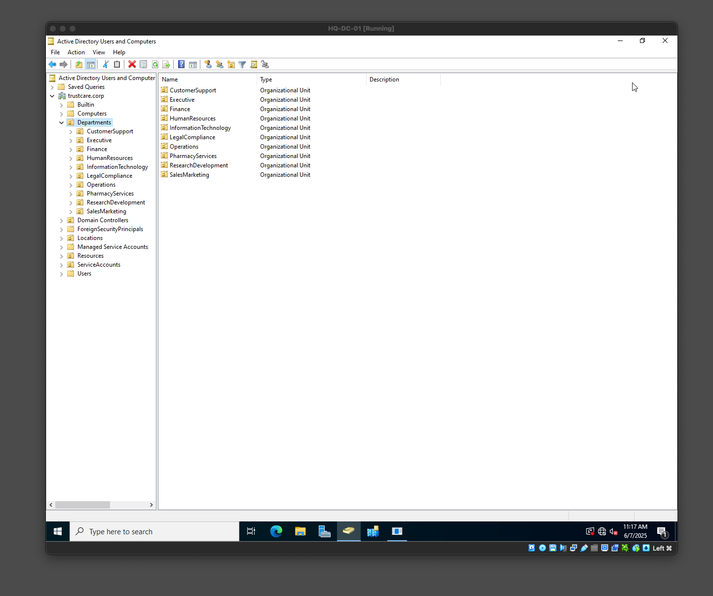
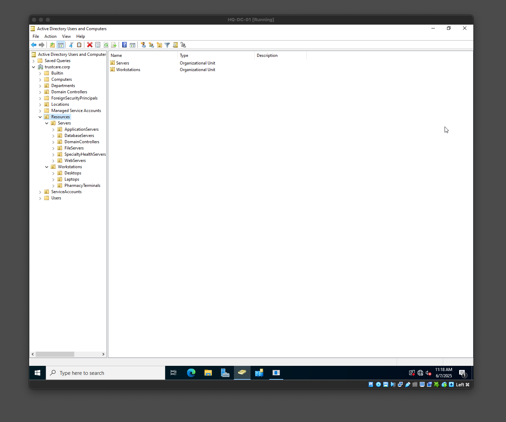
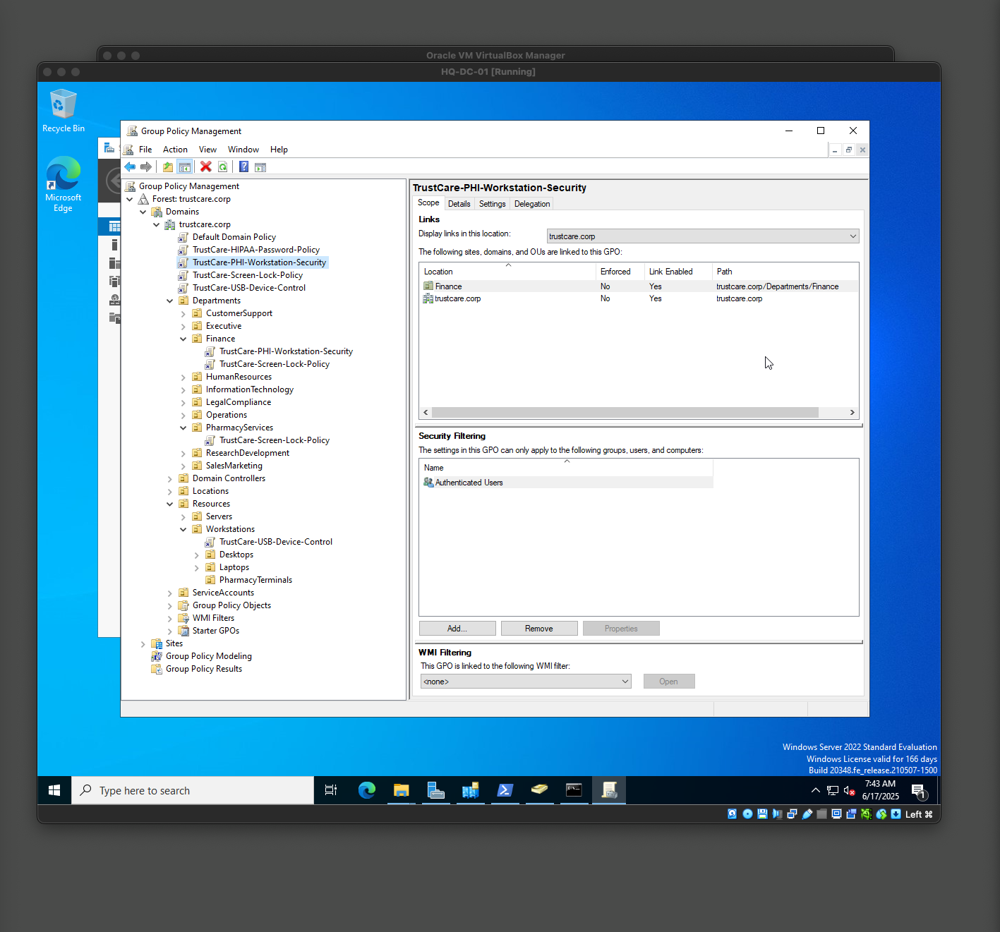
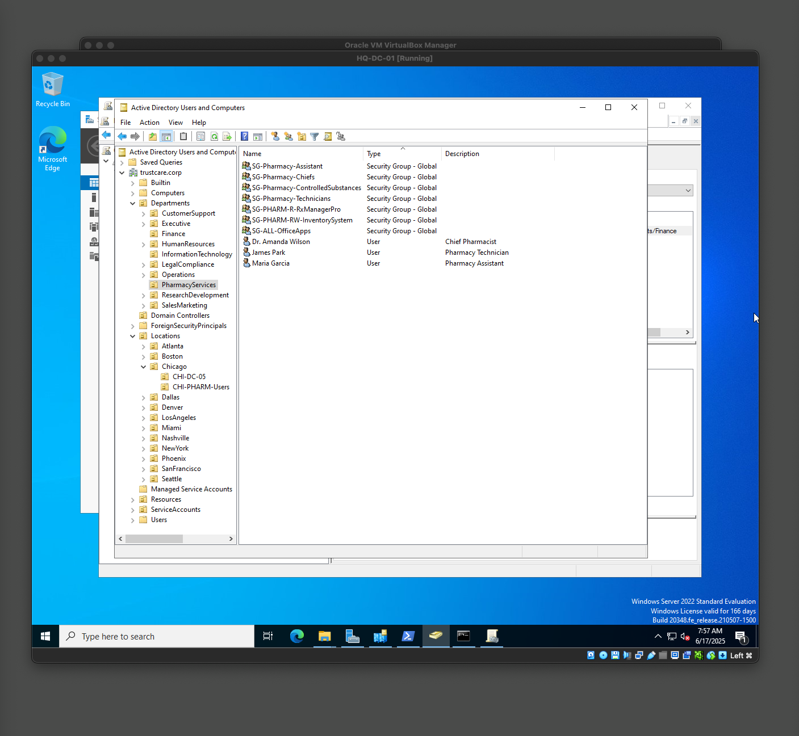
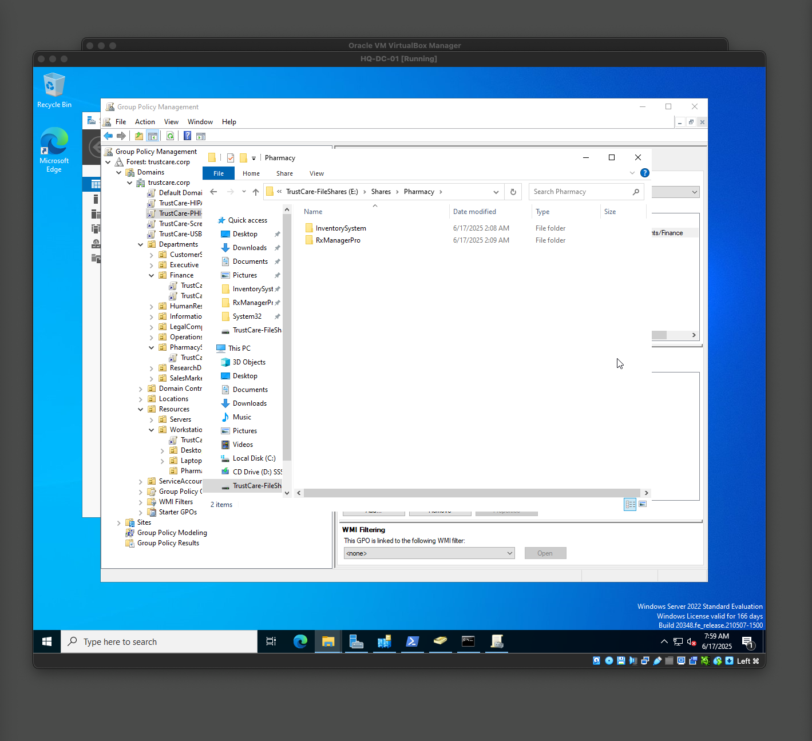
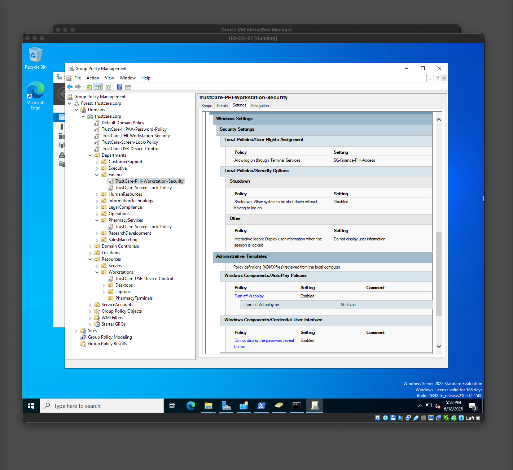
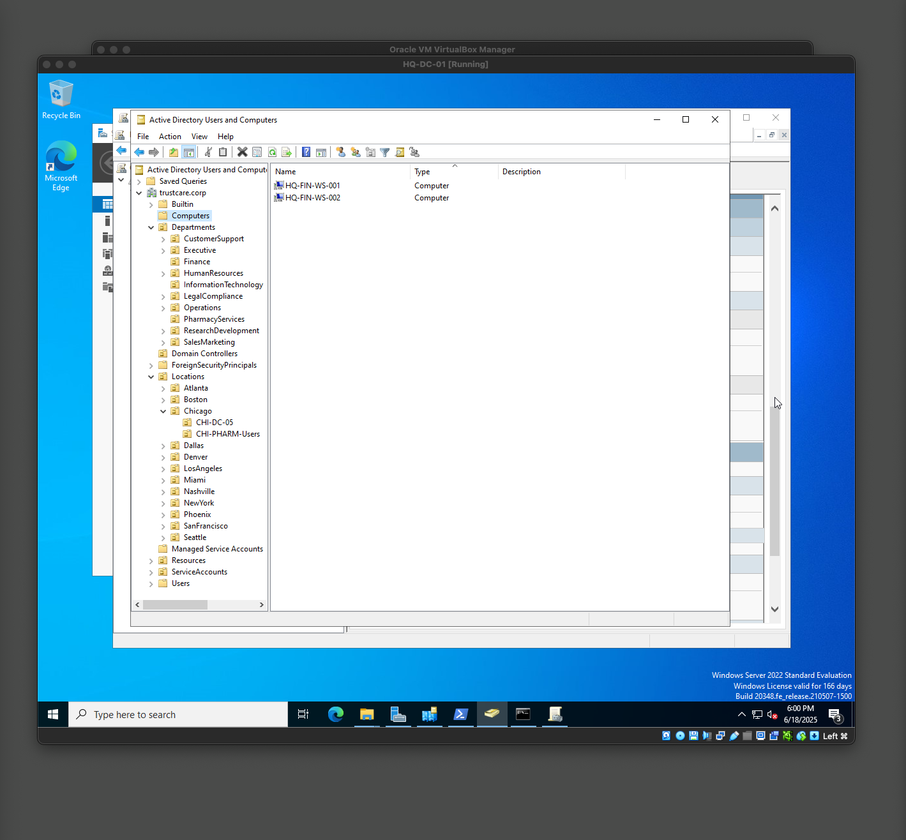

# Organizational Unit Structure

---
### ⭐️ Objectives
**OU Structure** 
Design the OU structure of the organization while considering scalability for the following areas: 
1. Location-based
2. Department-based
3. Resource type-based (servers, workstattion and users)

**Group Policy Requirements** 
1. Role-based access controls
2. Enhanced security for PHI/PII handling workstations
3. Strict password and account lockout policies
4. Endpoint protection policies (To be covered in Day in Life Policies)

**Authentication Requirements**
(To be covered in Day in Life Policies)
1. Multi-factor authentication for remote access 
2. Smart card authentication for high-security roles (I may not be able to cover this but will substitute)
3. Single sign-on capabilities 

---
### ✅ Key Deliverables:
Implementation of hierarchical OU structure supporting location-based, department-based, and resource-based organization with proper delegation of control.
- [x] Multi-tiered OU hierarchy
- [x] Delegation of control implementation
- [x] Group Policy inheritance planning
- [x] Security boundary establishment

---
### 🧠 Key Takeaways 
1. OU is used for organization and setting security policies
2. OUs are different from containers 
3. OUs help seperate things to be easier to find. It also divides responsibilities eg Finance manager in finance dept
4. OUs helps to protect data and organization so that everything is not left out in the open 
5. GPO are very powerful because it gives a lot of flexibilty to implement authorization - ie who can access what, from which department. Also used to separate things and people as well as to create distribution list
6. GPO also enables fine-grained access. We can create a complex matrix of who has access to what and also make it granular. Like this is the core of Authorization in IAM. Ability to know who has access to what. This approach is most likely similar in other authorization systems.
7. Due to the nature that GPOs can be complex I have dedicated a section "Day in Life Policies" to go into the depth and explore my learining journey.

---
### 📁 OU Structure
Below is the architectural design of OU structure based on the above requirements  
```
# Active Directory OU Structure Design

# Colors:
#   - BLUE:   Top-Level OUs
#   - GREEN:  Location-Based
#   - ORANGE: Department-Based
#   - YELLOW: Resource Type-Based
#   - GRAY:   General Notes/Connectors

#---------------------------------------------------------------------------------------
# Top-Level OU Structure
# - Establishes the main organizational divisions
#---------------------------------------------------------------------------------------

BLUE TrustCare Health Systems
#   |---BLUE Locations     # For location-specific organization
#   |---BLUE Departments   # For department-specific organization
#   |---BLUE Resources     # For managing resources (servers, workstations)
#   |---BLUE ServiceAccounts # For service accounts

#---------------------------------------------------------------------------------------
# 1. Location-Based OU Structure
# - Organizes objects by physical location
#---------------------------------------------------------------------------------------

BLUE Locations
#   |---GREEN Atlanta
#   |   |---GREEN Atlanta-HQ   # Headquarters
#   |   |---GREEN Atlanta-DC1  # Primary DC
#   |---GREEN Boston
#   |---GREEN Chicago
#   |---GREEN Los Angeles
#   |---GREEN Dallas
#   |---GREEN Phoenix
#   |---GREEN Nashville
#   |---GREEN New York
#   |---GREEN San Francisco
#   |---GREEN Denver
#   |---GREEN Miami
#   |---GREEN Seattle

#---------------------------------------------------------------------------------------
# 2. Department-Based OU Structure
# - Organizes user accounts by department
#---------------------------------------------------------------------------------------

BLUE Departments
#   |---ORANGE Executive
#   |---ORANGE Finance
#   |---ORANGE HumanResources
#   |---ORANGE InformationTechnology
#   |---ORANGE Operations
#   |---ORANGE SalesMarketing
#   |---ORANGE PharmacyServices
#   |---ORANGE ResearchDevelopment
#   |---ORANGE LegalCompliance
#   |---ORANGE CustomerSupport

#---------------------------------------------------------------------------------------
# 3. Resource Type-Based OU Structure
# - Organizes computer and server objects
#---------------------------------------------------------------------------------------

BLUE Resources
#   |---YELLOW Workstations
#   |   |---YELLOW Desktops
#   |   |---YELLOW Laptops
#   |   |---YELLOW PharmacyTerminals # Special workstations
#   |---YELLOW Servers
#   |   |---YELLOW DomainControllers
#   |   |---YELLOW FileServers
#   |   |---YELLOW ApplicationServers
#   |   |---YELLOW DatabaseServers
#   |   |---YELLOW WebServers
#   |   |---YELLOW SpecialtyHealthServers

#---------------------------------------------------------------------------------------
# Additional Notes:
# - This is a hierarchical structure, OUs can be nested further as needed.
# - Group Policy Objects (GPOs) will be linked at appropriate OU levels to enforce settings.
# - Delegation of control will be used to grant specific administrative permissions at the OU level.
# - Consider creating sub-OUs within Departments for more granular management (e.g., Finance -> Accounting, Payroll).
# - The "ServiceAccounts" OU is for managing service accounts used by applications/services.
#---------------------------------------------------------------------------------------
```

---
### 📂 Top Level OUs 


---
### 📂 Location Based OUs 


---
### 📂 Department Based OUs 


---
### 📂 Resource Based OUs 


---
### 🗂️ Group Policy Requirement 
After creating OU structure to divide up things and responsibilities, we can now create several GPO based on the several OUs eg location, departments (or people), or the workstations. This helps to delegate control for each structure or division. Here’s a breakdown of how it helps in the following areas:

1. **Multi-Tiered OU Hierarchy** - Although I kept the nested structure not too deep, but shallow at most 3 levels deep. This helps in management. Additionally this helps to have GPOs that can be placed at top level to force inheritance. This also works at the child level where either the child could force the GPO set at that level or inherit from the parent and so override the child rule. The multi-tiered OU allows for this. See screenshot below 
2. **Delegation of control implementation** - The benefits of having the multi-layered structure is that it allows for delegation of control. For example in the pharmacy department I implemented several GPOs for Pharmacy retail: staff, manager, etc and also one for the managers Eg SG-PHARM-R-RxManagerPro. With the staffs assigned to the right OU and member of certain group we can have the Pharmacy managers administer the Pharmacy employees. This is clearly separated from other departments like Finance, Executive etc which all have their separate assigned responsibilities. This is where delegation of control shines. See screenshot below

3. **Security boundary establishment** - The hierarchy and delegation also help establish security boundaries. In addition using GPO, in the pharmacy department, can also help establish who can read or write access to certain shared directories and files. I’ll discuss more about this in the (Day in Life tasks I - establishing read write access for shared resources [Link]). 

The screenshot above shows the final folders in the Pharmacy resource in E: networked linked drive. I also implemented fine-grained access control on this drive location so if only employees in the Pharmacy can access the drive. Moreover those that have read rights can see the files but only those that have read write access can read and modify the files in that directory.  
4. **Role-based Access control** - The GPOs enable fine-grained access control based on roles. For example in when onboarding users for Pharmacy department there are several roles and who can access what and not ie SG-PHARM-R-RxManagerPro, SG-PHARM-RW-InventorySystem, SG-ALL-OfficeApps, DL-Pharmacy-Staff (See more in Day in life tasks I). This will be similar in other departments as needs arizes. This is the authorization part of IAM.
5. **Enhanced Security for PHI/PII handling workstation** - The combination of the OU and GPO's with password policies, RBAC for who can access file or not, all enable PHI/PII for the handling of workstations.  
6. **Strict password and account lockout policies** - I implemented this in the password and account GPO. This is also at the top level so it cascades down the trustcare domain. As default, this will meet all the PHI/PII and HIPAA standards. For other accounts that need more strict policies, we can create additional GPO and assign it to the OU level. Added a Client computer and created users to test policies, more details in the Day in life tasks I.  Below is the implemented password and lockout policy- 

---
## 🔐 Implemented Password & Account lockout policies

```
powershell
<#
================================================================================
                        TrustCare HIPAA Password Policy
================================================================================

Name:           TrustCare-HIPAA-Password-Policy
Purpose:        Enforce strict password requirements for healthcare compliance
Created By:     [Your Name]
Created Date:   [Date]
Version:        1.0
Compliance:     HIPAA, HITECH Act

================================================================================
                              POLICY SETTINGS
================================================================================

Computer Configuration → Policies → Windows Settings → Security Settings → 
Account Policies → Password Policy:

    ┌─ Password Requirements ─────────────────────────────────────────────────┐
    │ • Minimum password length: 12 characters                                │
    │ • Password must meet complexity requirements: Enabled                   │
    │ • Maximum password age: 90 days                                         │
    │ • Minimum password age: 1 day                                           │
    │ • Enforce password history: 12 passwords                                │
    │ • Store passwords using reversible encryption: Disabled                 │
    └─────────────────────────────────────────────────────────────────────────┘

Account Lockout Policy:

    ┌─ Lockout Settings ──────────────────────────────────────────────────────┐
    │ • Account lockout threshold: 5 invalid attempts                         │
    │ • Account lockout duration: 30 minutes                                  │
    │ • Reset account lockout counter after: 30 minutes                       │
    └─────────────────────────────────────────────────────────────────────────┘

================================================================================
                                USAGE NOTES
================================================================================

This policy should be applied to:
- All domain user accounts
- Service accounts (with exceptions documented)
- Administrative accounts (consider stricter requirements)

Exclusions:
- Emergency access accounts (separate policy)
- System service accounts (case-by-case basis)

Testing:
- Test in lab environment before production deployment
- Verify compatibility with legacy applications
- Document any password policy conflicts

================================================================================
#>

# HIPAA
New-GPO -Name "TrustCare-HIPAA-Password-Policy" -Comment "HIPAA compliant password policy for healthcare environment"
```

---
### 🔑 Implemented Password & Account lockout Policies 


---
### 🔑 Screen Showing policies on DCs 


---
### 🚪 Client machine setup (Discussed more in Day in Life Tasks 1) 


